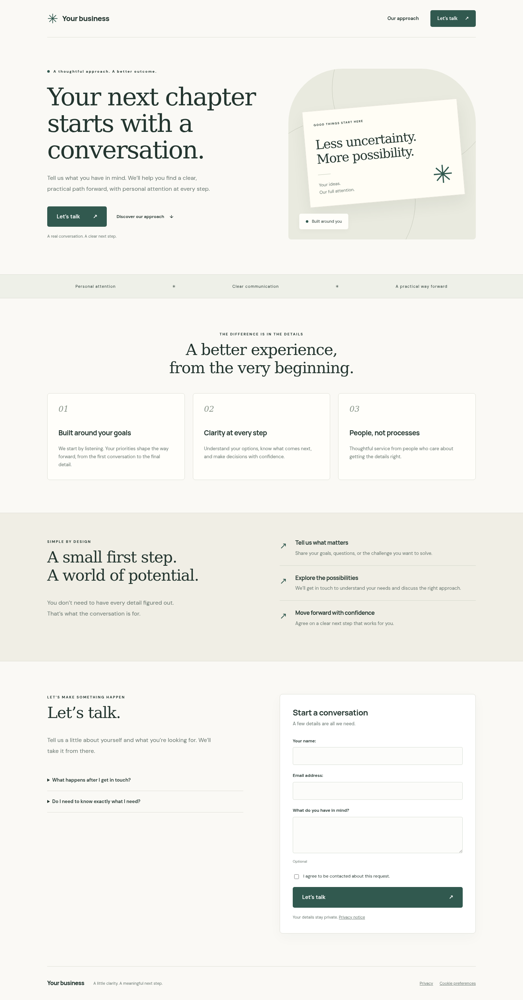

# LeadHarbor

**A thoughtful first impression. A measurable next step.**

Launch a branded business website with a real backend: editable content, contact
forms, booking requests, a polished Django admin, first-party visitor intelligence,
and Telegram journey notifications. Add an optional business brief and Codex
adapts the project after provisioning.

[](https://portacode.com/dashboard/?portafile=https%3A%2F%2Fraw.githubusercontent.com%2Fportacode%2FLeadHarbor%2Fmain%2Fportafile.yaml)



## Make it yours

Every business input is optional. Start with the defaults or supply your business
name, headline, description, color, logo, photo, contact email and preferred
conversion flow. No code editing is needed for these fields.

| Visitor action | Ready-made workflow | What counts as success |
| --- | --- | --- |
| Contact, quote, application, waitlist | Configurable, validated form → request inbox | A valid request saved by the server |
| Request a consultation or appointment | Preferred date + details → team follow-up | A request; availability still needs confirmation |
| Book through an existing provider | External HTTPS calendar link | Calendar opened; **not** a confirmed booking |

After launch, edit content, form fields, FAQs, real customer quotes, goals and
branding in Django admin. Requests have statuses and private team notes.

## One click, a complete project

1. Click **Deploy with Portacode** and select your infrastructure. Connect Codex
   to your Portacode account (the template declares this prerequisite).
2. Fill any optional business fields. For AI customization, describe your audience,
   offer, preferred style, form questions, funnel and success metrics.
3. Provisioning installs PostgreSQL, Django, nginx and dedicated app/worker
   services, generates unique credentials, and validates the application.
4. If a prompt was supplied, Codex customizes the provisioned project. Tests and
   deployment checks must pass before its changes are activated.
5. Open your exposed website URL. Visit `/admin/` for your business workspace or
   `/dashboard/` for visitor intelligence. Retrieve your generated username and
   password from **`/opt/LeadHarbor/.private/ADMIN-CREDENTIALS.md`** in the
   private Portacode device file browser. Change the password after first login.

Credentials never appear in provisioning logs or public URLs. An empty prompt
skips AI execution. AI customization uses the connected owner's Codex allowance;
no OpenAI key is collected by this template. The site itself needs no AI runtime.

Example brief:

> Build a calm, premium website for an independent landscape designer. Use the
> uploaded logo and olive branding. Ask for location, approximate garden size,
> budget range and preferred consultation date. Optimize for qualified consultation
> requests. Measure visitors who explore the process, start the form, and submit.
> Include FAQs about planning and timelines, without inventing prices or reviews.

## Understand what converts

- Attribution: referral origin, source, medium and campaign.
- Device context: device class/name, browser, OS, language and timezone.
- Location: IP, approximate city/region/country, network/ISP and lookup status.
- Attention: active-time heartbeats, scroll depth, human-interaction signals,
  clicks, section views, meaningful hovering and exit intent.
- Conversion: form starts, validation errors, booking-link intent and server-saved
  requests, with configurable goals and conversion rates.
- Journeys: readable grouped actions, explored-but-not-clicked elements, funnel
  progression, filters, daily trends and a request inbox.

Rates use unique tracked sessions in the selected window. Human confidence is a
behavioral heuristic. Missing events are possible; this is operational analytics,
not accounting or identity verification. Consent-free requests remain functional
and appear separately as unattributed requests. Analytics uses a signed, HttpOnly
30-minute journey cookie; visitor uniqueness is scoped to that journey, not a
cross-device or permanent identity.

## Telegram, without the noise

Optionally provide a **dedicated** bot token from Telegram's BotFather. Message the
bot, then in **Admin → Telegram accounts** link the discovered private chat to an
active staff account. Unlinked chats receive no analytics. No chat ID is guessed
or automatically authorized. Use a dedicated bot without an active webhook.

Staff can enable traffic, engagement, funnel and lead categories independently.
One message per journey/recipient is edited as the journey evolves. Messages show
approximate location, device/OS/browser, attribution, human-confidence heuristic,
duration, meaningful clicks/exploration and conversion progression. Buttons mute a
category, pause for 24 hours or stop notifications. Form answers are kept in the
admin inbox, not copied into Telegram. Without consent there is no tracked journey
and therefore no journey notification; the business request is still saved.

## Local development

Python 3.11+ is required. SQLite is convenient locally; provisioning uses PostgreSQL.

```bash
python3 -m venv .venv
.venv/bin/pip install -r requirements.lock
.venv/bin/python scripts/configure.py
.venv/bin/python manage.py migrate
.venv/bin/python manage.py bootstrap
.venv/bin/python manage.py collectstatic --noinput
DEBUG=true .venv/bin/python manage.py runserver
```

Open `http://localhost:8000`. Your private credential file is `.private/ADMIN-CREDENTIALS.md`.
To test Telegram locally, configure your own token and run
`.venv/bin/python manage.py run_analytics_worker` in another terminal.

```bash
.venv/bin/python manage.py test --settings=config.test_settings
.venv/bin/python manage.py makemigrations --check --dry-run --settings=config.test_settings
```

## Project guide

Read [AGENTS.md](AGENTS.md) for the AI customization map, [operations](docs/operations.md)
for deployment and backups, and [measurement](docs/measurement.md) for metric semantics.
Dependencies include Django, Django Unfold, django-axes, Pillow, psycopg, WhiteNoise,
Gunicorn, Requests and user-agents. Versions are pinned in `requirements.lock`.

The analytics foundation is adapted from the owner's menas.pro reference, with
business-agnostic content and workflows. No personal branding, data or credentials
are included. This is a Portacode deployment template; GitHub's separate “template
repository” flag is not required to use its deploy button.

## Optional GitHub CI

[The example workflow](docs/examples/github-checks.yml) runs application tests,
migration checks and syntax validation on pushes and pull requests. It is not
active by default. To enable it, copy it to `.github/workflows/checks.yml` using
a GitHub connection with workflow-write permission. Portacode runs deployment
validation independently of GitHub Actions.
